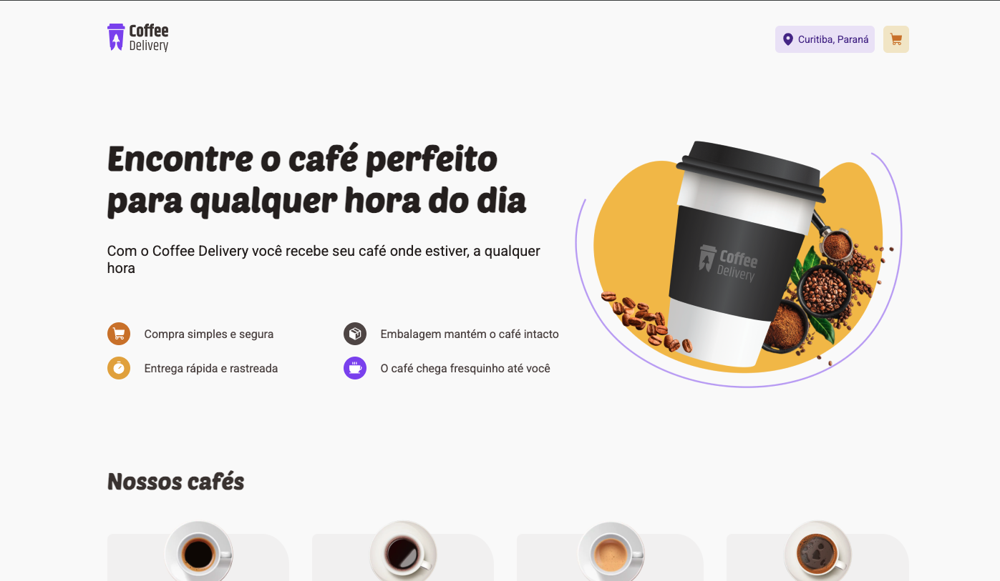

# Coffee Delivery




## Description

**Coffee Delivery** is a modern, responsive ecommerce application for ordering coffee online. Built as part of a Rocketseat React course, this project focuses on mastering advanced React patterns, including Hooks, Context API, and best practices for scalable front-end development.

The app allows users to:
- Browse a catalog of coffee products
- Add coffees to a shopping cart
- Complete a checkout process with address and payment forms
- Enjoy a responsive user experience on desktop and mobile

## Features

- ☕ Browse a curated selection of coffee products
- 🛒 Add, remove, and update items in your shopping cart
- 📦 Fast, tracked delivery simulation
- 📄 Checkout with address and payment forms, including real-time validation
- 💡 Context-based global state management
- 🔥 Responsive design with Styled Components
- ✅ Form validation powered by Zod and React Hook Form

## Technologies

- [Vite](https://vitejs.dev/)
- [ReactJS](https://react.dev/learn)
- [TypeScript](https://www.typescriptlang.org/)
- [Styled Components](https://styled-components.com/)
- [React Hot Toast](https://react-hot-toast.com/)
- [React Hook Form](https://react-hook-form.com/)
- [Zod](https://zod.dev/)
- [Google Fonts](https://fonts.google.com/)

## Getting Started

### Prerequisites

- Node.js v19 or higher

### Installation

```bash
git clone https://github.com/pamelasantoss/ignite-coffee-delivery.git
cd ignite-coffee-delivery
npm install
npm run dev
```

Visit [http://localhost:5173](http://localhost:5173) to view the app.

### Build for Production

```bash
npm run build
npm run preview
```

## Project Structure

- `src/components`: Reusable UI components (e.g., ProductCard, AddressForm, Loader)
- `src/pages`: Main application pages (e.g., Home, Checkout)
- `src/contexts`: Global state providers (Cart, Location)
- `src/styles`: Theming and global styles

## Learning Goals

This project was built to practice and demonstrate:
- State management with React Context API
- Advanced React Hooks patterns
- Type safety and maintainability with TypeScript
- Modern styling with Styled Components
- User-friendly forms with validation using React Hook Form and Zod

## Contributing

Contributions are welcome! Feel free to open issues or submit pull requests.

## License

This project is under the MIT license. See [LICENSE](https://github.com/pamelasantoss/ignite-coffee-delivery/blob/main/LICENSE) for details.

---

Made with ❤️ by [Pamela Santos](https://pamelasantos.dev.br/)